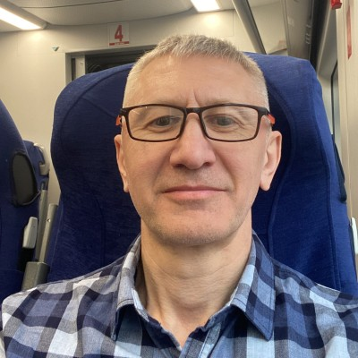

|  |  |
|:---|:---|
| Coursera is the global online learning platform that offers anyone, anywhere access to online courses and degrees from world-class universities and companies. | Google is a multinational corporation specializing in internet-related services and products. |

|    | [Resume](/Resume/DA%20Resume.pdf)   [LinkedIn](https://www.linkedin.com/in/igor-sorochan-3a1485264/)   [GitHub](https://github.com/IgorBeHolder)   [Kaggle](https://www.kaggle.com/igorsorochan/competitions)   +90 535-639-8703  [isorochan\@gmail.com](mailto:isorochan@gmail.com)   For more information, please contact me via email. |
|-----|:---------------------------------------------------------------------------------------------------------------------------------------------------------------------------------------------------------------------------------------------------------------------------------------------------------------------------------------------------------------------------------|
|     |                                                                                                                                                                                                                                                                                                                                                                                  |

This repository is for sharing projects that I found interesting. Don't hesitate to ask.

| Project                                                                                   | Language | Output                                                                                                         |                                                                                                                                                                                                                                                                      |
|:------------------------------------------------------------------------------------------|:---------|:---------------------------------------------------------------------------------------------------------------|:---------------------------------------------------------------------------------------------------------------------------------------------------------------------------------------------------------------------------------------------------------------------|
| Coursera Capstone project.   Google Data Analyst professional certificate program    | R        | [HTML document](/Case_study/CS_3.html)   [GitHub document](/Case_study/CS_3.md)   [Slides](https://docs.google.com/presentation/d/1SfW3tptsrS7h582H443bq5B76kD1XkVBgsjMKCB3R9g/edit?usp=sharing)   [Tableau](https://public.tableau.com/views/Google_DA_Certificate/Dashboard2?:language=en-US&:display_count=n&:origin=viz_share_link)       | Project have done in **R-studio** and knitted to github document.   Currently R notebooks in GitHub has a limited performance.   Best practice is to save and open html document which includes interactive plotly graphics and has a better presentation. |
| One-armed bandit slot machine simulator                                                   | Python   | [Google Colab Notebook](https://colab.research.google.com/drive/1XGkMiF_dWvoNognW9dxFVx-6rfXnr1Y6?usp=sharing) | Monte Carlo method in action. Plotly visuals |
| "Churn prediction". [MIPT](https://mipt.ru/english/edu/phystechschools/psami) competition | Python   | [Kaggle](https://www.kaggle.com/igorsorochan/competitions)                                                     | 24 out of 3095 students (top 0.7%) |
|Videogames dataset. Statistical tests| Python| [Google Colab](https://drive.google.com/file/d/1ehe3XbOvpq1d9tNQI34P9WTMQ9yhlz5h/view?usp=sharing) | Student  T-test for the mean of ONE group of scores, Shapiro test, plotly express viz.|

I'm interested in hightech, sports, photography.  
There are moments when mental focus is difficult  and then mountain biking comes to the rescue.
Look up my [strava profile](https://www.strava.com/athletes/2754950).
